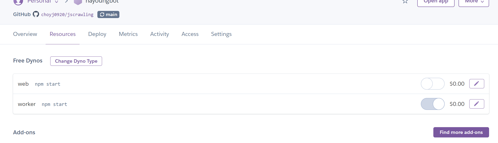
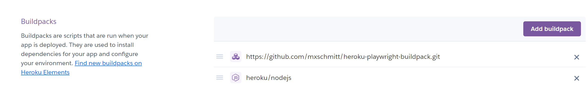

# 😀LostARK search bot (+HayoungBot)
####  ***Discord bot for search LOSTARK Character ***


로아의 전정실에서 data 가져와서 디코에 띄우기 -

캐릭터의 정보정도는 그냥 html만으로 가져올수있지만 원정대 정보나 아이템 트포 상태 등의 경우 동적으로 가져와야해서 PlayWright 라이브러리 사용


```javascript
const playwright = require('playwright');
const jsdom = require("jsdom");
const Discord = require('discord.js')

async function getData(charactername){
  for (const browserType of [playwright.chromium]) { // 크로니움으로 열기
    const browser = await browserType.launch();
    const context = await browser.newContext();
    const page = await context.newPage();
    await page.goto(`https://lostark.game.onstove.com/Profile/Character/${charactername}`)//사이트
    
    const content = await page.content(); //content 가져오기

    // html 리더
    const dom = new jsdom.JSDOM(content);

    characterData={}
    characterData["Character_Name"]=charactername

    engravearr=[]
    dom.window.document.querySelectorAll("ul[class^='swiper-slide'] > li > span").forEach(element => {
        engravearr.push(element.textContent)
    });
    characterData["Engrave"]=engravearr
    // 직업 로고
    class_Logo = dom.window.document.querySelector("#lostark-wrapper > div > main > div > div.profile-character-info > img")
    characterData['Class_Logo']=class_Logo.src

    await browser.close();

    return characterData
  }
};
```


## Bot +Heroku 

1. heroku 가입 후 깃허브 연결, 토큰등 정보를 가린후

2. Procfile 만들기 -heroku에서 실행 명령어를 위해 루트 폴더에 넣어두면됨 -확장명 없이

   ```
   worker: npm start
   
   ```

3.  git에 업로드가 되면 바로 실행

    

4.  PlayWright 오류, 여타 라이브러리 오류

   1.  사용하는 모든 라이브러리 package.json 에 정리

   2. playWright의 경우 추가적인 작업 필요 

      1. buildpack에 추가 

      2. 여러 브라우저가 포함되어있는 playwright에서 간소화하여  하나의 브라우저로 포함되어 있는 라이브러리사용

      3. 그에 따른 package.json 정리

      4. ```json
         "dependencies": {
             "playwright-chromium": "^1.9.0",
         }
         ```

      PlayWright와 heroku  간단하게 썼지만 하루종일 고생했다 .

5.  다시 실행 성공! 

   

   

   ## ----------------------------

   저저번주 주말부터? 음악재생 봇 만들고 이번주에는 LOSTARK 캐릭터 정보를 가져와서 보여주는 봇의 기능을 구현했는데 친구들이 내가 퇴근해서 봇을 끄면 자꾸 내봇이 안된다고 머라머라 해서 서버에 띄우는걸 찾아서 띄워보았다. 

   이제 내일은 아마 행사있어서 바쁠테니 모레? ~~부터는 본격적으로 동적으로 웹 데이터를 가져오는걸 해봐야겠다.~~

   ~~그리고 discord Bot 말고 카카오톡 응답 봇? 응답기?로도 해볼 계획 .. 설렌다~~

   
